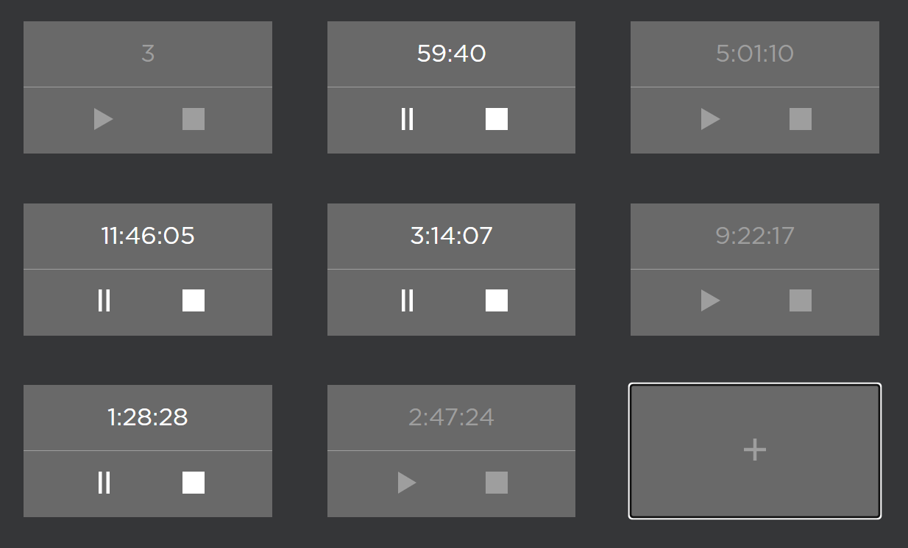

# timers



Задание:
Создать страницу с секундомерами. 

Каждый секундомер должен иметь 3 функции:
1. Запуск
2. Пауза
3. Сброс

Кроме секундомеров на странице должна быть кнопка, которая добавляет новый секундомер в список.

## Project Setup

```sh
npm install
```

### Compile and Hot-Reload for Development

```sh
npm run dev
```

### Compile and Minify for Production

```sh
npm run build
```

### Lint with [ESLint](https://eslint.org/)

```sh
npm run lint
```
